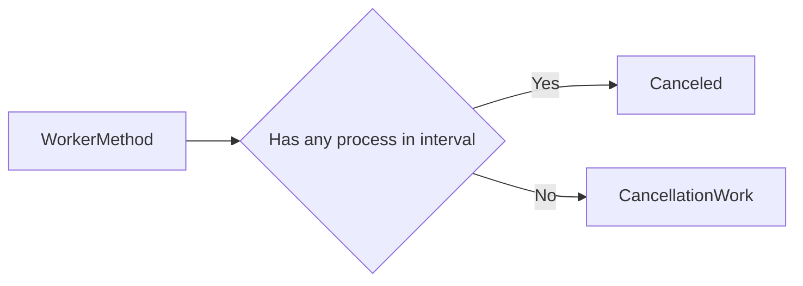

<h1 align="center">
Timing
</h1>

## TimeSpan

This class helps you generate the millisecond values you need.

**_Methods_**

- FromSecond
- FromMinute
- FromHour
- FromDay
- FromWeek

<p align="center">
<i align="center">More Manufacturing Methods</i>
</p>

<p align="center">
<a href="https://github.com/hanifiyildirimdagi/nu-core/issues">Create Issiue</a>
</p>

## Sleep

This static method allows you to wait a certain amount of time with the async/await method.

> Example
>
> ```ts
> import { Timing } from "necessary-utils-core";
> //doSomething...
> await Timing.Wait(1000);
> //continue...
> ```
> 
> ```ts
> import { Timing } from "necessary-utils-core";
> //doSomething...
> Timing.Wait(1000).then(()=> {
>  //continue...
> });
> ```

> Example with TimeSpan
>
> ```ts
> import { Timing, TimeSpan } from "necessary-utils-core";
> // EXAMPLS OF TimeSpan methods
> //TimeSpan.FromSecond(10) -> 10 seconds
> //TimeSpan.FromMinute(10) -> 10 minutes
> //TimeSpan.FromHour(1) -> 1 hour
> //TimeSpan.FromDay(2) -> 2 hour
> //TimeSpan.FromWeek(3) -> 3 week
>
> /*its waits for 10 seconds.*/
> await Timing.Wait(TimeSpan.FromSecond(10));
>
> /*its waits for 1 minute.*/
> await Timing.Wait(TimeSpan.FromMinute(1));
> ```

## CancellationWork

This static method allows a job to be done only once, within a period of time you specify. For example, you produce a console output every time a character is entered into the input box. But you want to produce results when the user is no longer entering data for a second. You can use `CancellationWork` for this and similar operations.

> Example
>
> ```ts
> import { Timing } from "necessary-utils-core";
>
> const work = () => {
>   console.log("Hello.");
> };
> Timing.CancellationWork(work, 1000);
> Timing.CancellationWork(work, 1000);
> Timing.CancellationWork(work, 1000);
> Timing.CancellationWork(work, 1000);
> Timing.CancellationWork(work, 1000);
> /**
>   Output : Hello.
>   One time.
> */
> ```

### How It Works ?



## StopWatch
This class generates a stopwatch so you can find out how long it takes to complete any given action. You can start, stop, restart and resume this stopwatch at any time.


### Properties & Methods
- `Start()` This method is used to start the stopwatch.
- `Stop()` This method stops the stopwatch and returns the total elapsed time by milliseconds. However, the elapsed time is not reset.
- `Reset()` This method stops the stopwatch. Also, it stops the stopwatch, if the stopwatch currently is running.
- `Resume()` This method resumes your stopwatch.
- `elapsedTime` This method returns the total elapsed time by milliseconds. It returns a 0 value if the stopwatch already never started.

> ```ts
> import {StopWatch} from "necessary-utils-core";
> const stopWatch = new StopWatch();
> stopWatch.Start();
> //doSomething...
> //doSomething...
> //doSomething...
> const result = stopWatch.Start();
> ```