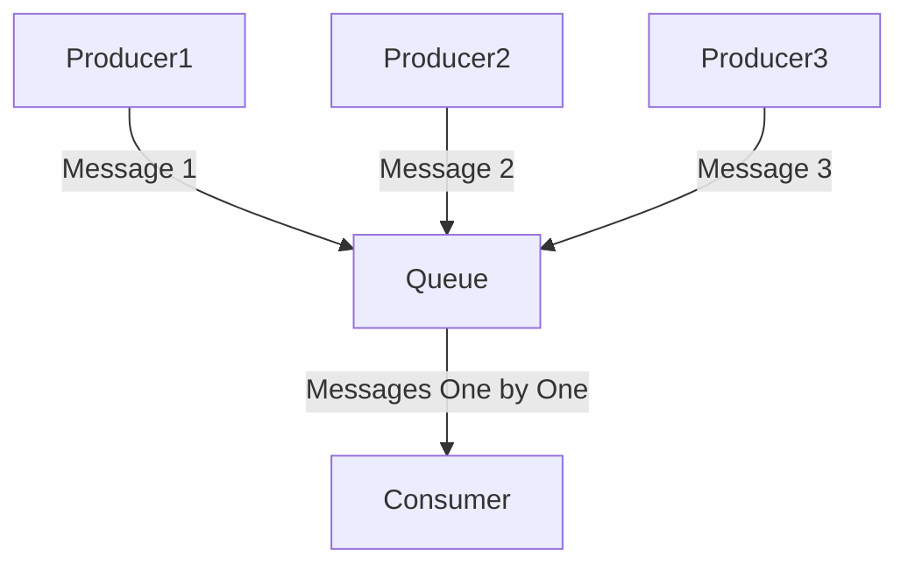
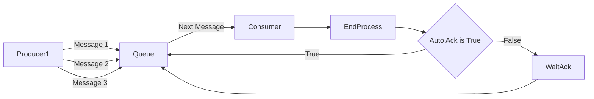

<center>
<h1>Necessary Utils | Basic Queue</h1>
<hr/>
<a href="https://www.npmjs.com/package/necessary-utils-basic-queue"></a>
<a href="https://www.npmjs.com/package/necessary-utils-basic-queue"></a>
<a href="https://www.npmjs.com/package/necessary-utils-basic-queue"></a>
<a href="https://www.npmjs.com/package/necessary-utils-basic-queue">
    
  </a>
</center>

## Getting started

### Yarn

```sh
yarn add necessary-utils-basic-queue
```

### NPM

```sh
npm install necessary-utils-basic-queue --save
```

## Building

```sh
yarn build
```

## Example

```ts
import {
  BasicQueue,
  BasicQueueMessage,
  QueueSettings,
} from "necessary-utils-basic-queue";

class ExampleMessage extends BasicQueueMessage {
  public MessageDetail: string;
  constructor(messageDetail: string) {
    this.MessageDetail = messageDetail;
  }
}

/**
 * Queue Created
 */
const queue = new BasicQueue<ExampleMessage>();

/**
 * Consumer Method Registered
 * Auto ACK = true
 */
queue.Consume((message: ExampleMessage) => {
  console.log(message.MessageDetail);
  // Do anything...
}, /*AUTO ACK = */ true);

/**
 * Start Produce
 */
queue.PushMessage(
  new ExampleMessage("Hello. This is my first message on the queue.")
);
```

## How its works ?

### Overview



### Consuming



## **Interceptors**

#### WhenAnyMessage

Returns exception if message count greater than `0` in the queue object.

> Example
>
> ```ts
> queue.Intercept.WhenAnyMessage();
> ```

#### WhenZeroMessage

Returns exception if message count equals `0` in the queue object.

> Example
>
> ```ts
> queue.Intercept.WhenZeroMessage();
> ```

#### WhenQueueStopped

Returns exception if queue object is idle position.

> Example
>
> ```ts
> queue.Intercept.WhenQueueStopped();
> ```

#### WhenQueueStarted

Returns exception if queue object is not idle position.

> Example
>
> ```ts
> queue.Intercept.WhenQueueStarted();
> ```

#### Custom Query

> Example
>
> ```ts
> queue.Intercept.When(
>   async (
>     messageCount: number,
>     currentMessage: T | null
>   ): Promise<boolean> => {
>     const validation = currentMessage.MessageDetail.length == 10;
>     return validation;
>   }
> );
> ```

#### Multiple Using

> Example
>
> ```ts
> queue.Intercept.WhenQueueStopped().WhenAnyMessage().***;
> ```
